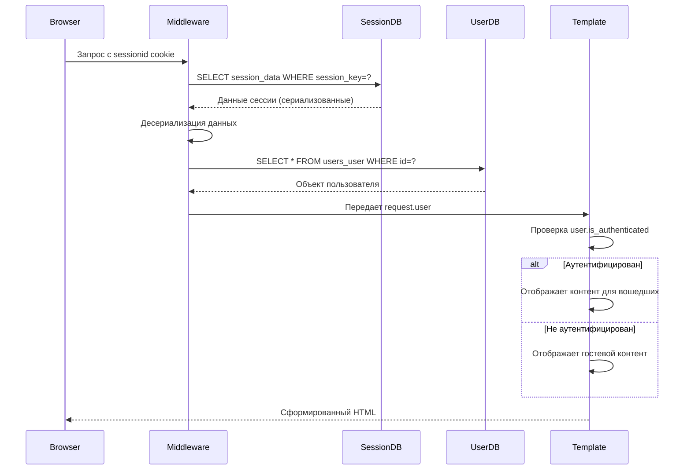

# Тема Django. User модель. Личный кабинет.  Урок 64

## Стандартная модель пользователя
- Является частью служебного приложения `auth`
- Имеет минмальный набор полей для работы с пользователями:
  - `first_name` - имя (не обязательное)
  - `last_name`
  - `password`
  - `last_login`
  - `is_superuser`
  - `is_staff`
  - `is_active`
  - `email`
  - `username`
  - ... остальные

Требование уникальности только для `username`
Для восстановления пароля, для уведомлений на email это не очень подходит 

Мы можем изменить логику работы формы регистрации так, чтобы проверять уникальность email 
и не позволить пользователю с таким же емейлом зарегистрироваться


## Будем работать с UserRegisterForm в приложении users

- `get_user_model()` - функция, которая возвращает активную модель пользователя


Убрали рендер подсказок из шаблона регистрации


    <small class="form-text text-muted">{{ field.help_text }}</small>


А можно так в инициализаторе класса формы

    # for field_name in ('username', 'password1', 'password2'):
    #     if self.fields.get(field_name): # Проверяем, существует ли поле
    #         self.fields[field_name].help_text = ''


В форму дописали проверку

    # Расширяем логику валидации поля email
    def clean_email(self):
        email = self.cleaned_data.get('email')
        if User.objects.filter(email=email).exists():
            raise forms.ValidationError("Пользователь с таким email уже существует.")
        return email
    
Теперь пользователь не сможет при регистрации указать email, который уже есть в базе данных


## Собственная модель пользователя

### Спасти базу!

Перед этими действиями желательно сделать бекап важных данных в базе. Например мастеров, услуги, связки... В общем все что есть в приложении `core`
Есть 2 способа. Dump через Django или экспорт через SqliteStudio. На лекции мы сделали второй вариант.

Данные потом залили через редактор.

### Собственная модель пользователя

У нас уже есть приложение для пользователей `users`

В моделях этого приложения мы можем создать свою модель пользователя

Мы должны наследоваться от AbstractUser (Почему? Что это даст?)

```python
from django.contrib.auth.models import AbstractUser
from django.db import models

class User(AbstractUser):
    # Убираем требование first_name и last_name, если они не обязательны
    first_name = None
    last_name = None

    email = models.EmailField(unique=True) # Делаем email уникальным и обязательным для логина
    
    avatar = models.ImageField(
        upload_to='users/avatars/', 
        null=True, 
        blank=True, 
        verbose_name='Аватар'
    )
    birth_date = models.DateField(
        null=True, 
        blank=True, 
        verbose_name='Дата рождения'
    )
    telegram_id = models.CharField(
        max_length=100, 
        blank=True, 
        null=True, 
        verbose_name='Telegram ID'
    )
    github_id = models.CharField(
        max_length=100, 
        blank=True, 
        null=True, 
        verbose_name='GitHub ID'
    )

    # Указываем, что для логина будет использоваться поле email
    USERNAME_FIELD = 'email'
    REQUIRED_FIELDS = ['username'] # username все еще нужен для AbstractUser, но можно сделать его не основным

    def __str__(self):
        return self.email # Или self.username, если предпочитаете

    class Meta:
        verbose_name = 'Пользователь'
        verbose_name_plural = 'Пользователи'
```

После этого нам надо указать модель пользователя в settings.py`AUTH_USER_MODEL = 'users.User'`

После чего нам нужно создать миграции
`poetry run python manage.py makemigrations`
`poetry run python manage.py migrate`

### Описание модели

- поискать в документации про `AbstractUser`, first_name = None, USERNAME_FIELD, REQUIRED_FIELDS

## Что мы можем делать с пользователем в шаблонах?

###  Как попадает в шаблоны

Источник: Автоматически добавляется контекстным процессором django.contrib.auth.context_processors.auth
Место настройки: barbershop/settings.py → TEMPLATES.OPTIONS.context_processors (строка 89)
Особенности:
Процессор работает для всех шаблонов проекта
Добавляет объект user даже для неаутентифицированных пользователей (тогда user.is_authenticated = False)
Для кастомной модели гарантируется правильный тип объекта (благодаря AUTH_USER_MODEL)


### Доступные опции и методы 


Базовые свойства (из AbstractUser):

username - имя пользователя (в вашем случае может быть пустым)
email - электронная почта (основной идентификатор)
is_authenticated - флаг аутентификации (True/False)
is_active - активен ли аккаунт
is_staff - доступ к админке
is_superuser - статус суперпользователя
date_joined - дата регистрации
last_login - последний вход
Кастомные поля (из вашей модели):

avatar - изображение аватара
birth_date - дата рождения
telegram_id - ID в Telegram
github_id - ID в GitHub
Методы:

get_username() - возвращает значение USERNAME_FIELD (email)
get_full_name() - не работает (т.к. first_name/last_name=None)
get_short_name() - не работает
has_perm(perm) - проверка прав
has_module_perms(app_label) - проверка прав доступа к приложению


### Как Джанго проверяет пользователя?

Пользователь запросил детальное описание процесса аутентификации и работу user.is_authenticated. Проанализируем механизм:

База данных:

Данные пользователя: users_user (таблица для кастомной модели users.User)
Сессии: django_session (хранит данные сессий)
Процесс проверки аутентификации:

При входе создается сессия и cookie sessionid
При каждом запросе middleware аутентификации проверяет сессию
is_authenticated - это свойство, а не метод (не требует вызова)
Детальный пошаговый процесс:

Браузер отправляет запрос с cookie sessionid
Django извлекает ключ сессии из cookie
Ищет запись в django_session по session_key
Десериализует данные сессии
Извлекает user_id из данных сессии
Ищет пользователя в users_user по user_id
Создает объект User и присваивает его request.user
В шаблоне user.is_authenticated проверяет:
Существует ли объект пользователя
Не является ли он анонимным пользователем
Активна ли учетная запись (is_active=True)
Mermaid-диаграмма:



Ключевые моменты:
Сессии: Хранятся в django_session (поля: session_key, session_data, expire_date)
Пользователи: Хранятся в users_user (кастомная таблица)
Безопасность:
Куки sessionid httpOnly
Данные сессии шифруются
По умолчанию срок действия сессии - 2 недели
Проверка в коде Django:
# django/contrib/auth/base_user.py
class AbstractBaseUser:
    @property
    def is_authenticated(self):
        return True  # Всегда True для реальных пользователей

# Для анонимных пользователей
class AnonymousUser:
    @property
    def is_authenticated(self):
        return False  # Всегда False

## Система шаблонов

### Базовый шаблон личного кабинета

### Меню инклюд кабинета 

### Шаблон детальной информации и редактирования профиля

## Вьюшки

-СДЕЛАТЬ ЗАГОЛОВКИ 3 УРОВНЯ С КАЖДОЙ ВЬЮШКОЙ ЛИЧНОГО КАБИНЕТА С ОПИСАНИЯМИ!!!!