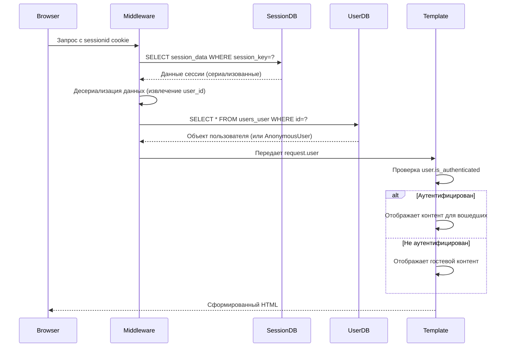

# Тема Django. User модель. Личный кабинет.  Урок 64

## Стандартная модель пользователя 👤
Стандартная модель пользователя в Django является фундаментальной частью системы аутентификации и авторизации. Она интегрирована в служебное приложение `auth` и предоставляет базовый набор полей, достаточный для большинства веб-приложений.

### Основные поля стандартной модели пользователя 📋

Стандартная модель `User` включает в себя минимальный, но достаточный набор полей для управления пользователями:
- `username`: Уникальное имя пользователя, которое по умолчанию используется для входа в систему. Это единственное поле, которое по умолчанию требует уникальности.
- `first_name`: Имя пользователя (необязательное поле).
- `last_name`: Фамилия пользователя (необязательное поле).
- `password`: Хэшированный пароль пользователя.
- `email`: Адрес электронной почты. По умолчанию не является уникальным и не используется для входа.
- `last_login`: Дата и время последнего входа пользователя.
- `is_superuser`: Булево поле, указывающее, является ли пользователь суперпользователем (имеет все права).
- `is_staff`: Булево поле, указывающее, имеет ли пользователь доступ к административной панели Django.
- `is_active`: Булево поле, указывающее, активна ли учетная запись пользователя. Неактивные пользователи не могут войти в систему.
- И другие служебные поля, такие как `date_joined`.

> [!info]
> #### Ограничения стандартной модели ⚠️
> Основное ограничение стандартной модели заключается в том, что только поле `username` является уникальным по умолчанию. Это может быть неудобно для современных приложений, где часто требуется уникальность `email` для регистрации и восстановления пароля. Если вы хотите использовать `email` в качестве основного идентификатора для входа, вам потребуется либо изменить логику формы регистрации, либо создать собственную модель пользователя.

Мы можем расширить логику работы формы регистрации, чтобы проверять уникальность `email` и предотвращать регистрацию пользователей с уже существующим адресом электронной почты. Это достигается путем добавления кастомной валидации в форму, как мы увидим далее.


## Работа с UserRegisterForm в приложении users 📝

В рамках работы с формами регистрации пользователей, особенно при использовании стандартной модели `User`, важно понимать, как взаимодействовать с активной моделью пользователя и как настраивать валидацию.
### Использование `get_user_model()` ⚙️

Функция `get_user_model()` является **рекомендуемым способом** получения активной модели пользователя в Django. Вместо прямого импорта `from django.contrib.auth.models import User`, использование `get_user_model()` гарантирует, что ваш код будет работать как со стандартной моделью `User`, так и с любой кастомной моделью, которую вы могли определить в `settings.AUTH_USER_MODEL`. Это обеспечивает гибкость и устойчивость вашего приложения к изменениям в конфигурации модели пользователя.

```python
from django.contrib.auth import get_user_model

User = get_user_model() # Получаем активную модель пользователя
```

### Настройка формы `UserRegisterForm` 📝

В приложении `users` мы работаем с формой `UserRegisterForm`, которая отвечает за регистрацию новых пользователей. Одной из распространенных задач является удаление стандартных подсказок (`help_text`), которые Django автоматически добавляет к полям формы. Эти подсказки могут быть избыточными или не соответствовать дизайну вашего интерфейса.

Изначально, подсказки могли быть убраны непосредственно в шаблоне, например, путем удаления следующего блока кода:

```html

    <small class="form-text text-muted">{{ field.help_text }}</small>

```

Однако, более **чистым и правильным подходом** является удаление `help_text` непосредственно в инициализаторе класса формы `UserRegisterForm`. Это позволяет контролировать поведение формы на уровне Python-кода, а не в шаблоне.

Пример кода в методе `__init__` формы `UserRegisterForm` для удаления `help_text`:

```python
# users/forms.py
# ...
class UserRegisterForm(UserCreationForm):
    # ...
    def __init__(self, *args, **kwargs):
        super().__init__(*args, **kwargs)
        # Убираем help_text для стандартных полей циклом
        for field_name in ('username', 'password1', 'password2'):
            if self.fields.get(field_name): # Проверяем, существует ли поле
                self.fields[field_name].help_text = ''
```

Этот подход гарантирует, что подсказки не будут генерироваться для указанных полей, независимо от того, как они будут рендериться в шаблоне.

### Валидация уникальности `email` 📧

По умолчанию, стандартная модель `User` в Django не требует уникальности поля `email`. Это может привести к проблемам, если вы хотите использовать `email` в качестве уникального идентификатора для регистрации или входа. Чтобы решить эту проблему, мы можем добавить кастомную логику валидации в метод `clean_email` формы `UserRegisterForm`.

Метод `clean_email` вызывается Django в процессе валидации формы и позволяет нам добавить собственную проверку для поля `email`. В данном случае, мы проверяем, существует ли уже пользователь с таким адресом электронной почты в базе данных.

```python
# users/forms.py
# ...
class UserRegisterForm(UserCreationForm):
    email = forms.EmailField(
        widget=forms.EmailInput(attrs={'class': 'form-control mb-2', 'placeholder': 'Email'}),
        required=True # Делаем email обязательным
    )
    # ...
    # Расширяем логику валидации поля email
    def clean_email(self):
        email = self.cleaned_data.get('email')
        if User.objects.filter(email=email).exists():
            raise forms.ValidationError("Пользователь с таким email уже существует.")
        return email
```

Благодаря этой проверке, пользователь не сможет зарегистрироваться, если указанный `email` уже используется. Это значительно улучшает пользовательский опыт и целостность данных.

Убрали рендер подсказок из шаблона регистрации. Это должно быть в блоке кода:
```html

    <small class="form-text text-muted">{{ field.help_text }}</small>

```

А можно так в инициализаторе класса формы:
```python
    # for field_name in ('username', 'password1', 'password2'):
    #     if self.fields.get(field_name): # Проверяем, существует ли поле
    #         self.fields[field_name].help_text = ''
```

В форму дописали проверку:
```python
    # Расширяем логику валидации поля email
    def clean_email(self):
        email = self.cleaned_data.get('email')
        if User.objects.filter(email=email).exists():
            raise forms.ValidationError("Пользователь с таким email уже существует.")
        return email
```
Теперь пользователь не сможет при регистрации указать email, который уже есть в базе данных.


## Собственная модель пользователя 🛠️

### Спасти базу! 🚨

Перед этими действиями желательно сделать бекап важных данных в базе. Например мастеров, услуги, связки... В общем все что есть в приложении `core`.
Есть 2 способа. Dump через Django или экспорт через SqliteStudio. На лекции мы сделали второй вариант.

Данные потом залили через редактор.

### Собственная модель пользователя

### Создание собственной модели пользователя 🛠️

Когда стандартная модель пользователя Django не удовлетворяет всем требованиям вашего проекта, например, если вам нужны дополнительные поля или вы хотите использовать `email` в качестве основного поля для входа, необходимо создать собственную модель пользователя. В нашем проекте уже есть приложение `users`, которое идеально подходит для размещения такой модели.

Мы создаем свою модель пользователя, наследуясь от `AbstractUser`. Это критически важный шаг, поскольку `AbstractUser` предоставляет полную функциональность стандартной модели `User`, включая все необходимые поля и методы для работы с аутентификацией, группами и разрешениями. Наследование от `AbstractUser` позволяет нам добавлять или изменять поля, не переписывая всю базовую логику аутентификации Django.

Вот как выглядит наша кастомная модель `User` в файле `users/models.py`:

```python
from django.contrib.auth.models import AbstractUser
from django.db import models

class User(AbstractUser):
    # Убираем требование first_name и last_name, если они не обязательны
    first_name = None
    last_name = None

    email = models.EmailField(unique=True) # Делаем email уникальным и обязательным для логина
    
    avatar = models.ImageField(
        upload_to='users/avatars/',
        null=True,
        blank=True,
        verbose_name='Аватар'
    )
    birth_date = models.DateField(
        null=True,
        blank=True,
        verbose_name='Дата рождения'
    )
    telegram_id = models.CharField(
        max_length=100,
        blank=True,
        null=True,
        verbose_name='Telegram ID'
    )
    github_id = models.CharField(
        max_length=100,
        blank=True,
        null=True,
        verbose_name='GitHub ID'
    )

    # Указываем, что для логина будет использоваться поле email
    USERNAME_FIELD = 'email'
    REQUIRED_FIELDS = ['username'] # username все еще нужен для AbstractUser, но можно сделать его не основным

    def __str__(self):
        return self.email # Или self.username, если предпочитаете

    class Meta:
        verbose_name = 'Пользователь'
        verbose_name_plural = 'Пользователи'
```
> [!info]
> #### Почему `AbstractUser`? 💡
> Наследование от `AbstractUser` дает нам возможность легко добавлять новые поля (например, `avatar`, `birth_date`, `telegram_id`, `github_id`) и переопределять существующие (например, делая `email` уникальным и используя его как `USERNAME_FIELD`). При этом мы сохраняем всю встроенную функциональность Django для управления пользователями, такую как хеширование паролей, управление сессиями и разрешениями.

### Настройка `AUTH_USER_MODEL` и миграции 🔄

После создания собственной модели пользователя, необходимо сообщить Django, какую модель использовать в качестве основной для аутентификации. Это делается путем добавления или изменения параметра `AUTH_USER_MODEL` в файле `settings.py` вашего проекта:

```python
# barbershop/settings.py
AUTH_USER_MODEL = 'users.User'
```

**Важно:** Это изменение должно быть сделано **до создания каких-либо миграций** или запуска команды `migrate` для вашего приложения `users`. Если у вас уже есть миграции, связанные с пользователями, вам, возможно, придется их удалить и создать заново, или выполнить более сложные операции по миграции данных.

После указания `AUTH_USER_MODEL`, необходимо создать и применить миграции для вашей новой модели:

```bash
poetry run python manage.py makemigrations
poetry run python manage.py migrate
```

Команда `makemigrations` создаст файл миграции, который описывает изменения в вашей модели `User` (добавление новых полей, изменение уникальности `email` и т.д.). Команда `migrate` применит эти изменения к вашей базе данных, создав или обновив соответствующую таблицу `users_user`.

### Описание модели ✨

При создании собственной модели пользователя в Django, наследование от `AbstractUser` является **ключевым решением**. `AbstractUser` предоставляет полную реализацию стандартной модели пользователя Django, включая все необходимые поля для аутентификации, такие как `password`, `last_login`, `is_superuser`, `is_staff`, `is_active`, `date_joined`, а также поля `username`, `first_name`, `last_name` и `email`. Это позволяет нам расширять или изменять поведение стандартной модели, не переписывая всю логику аутентификации с нуля.

#### `AbstractUser` и его поля 📚

`AbstractUser` включает в себя множество полей, которые мы можем переопределить или использовать:
- `username`: Уникальное имя пользователя.
- `first_name`: Имя пользователя.
- `last_name`: Фамилия пользователя.
- `email`: Адрес электронной почты.
- `is_staff`: Флаг, указывающий, имеет ли пользователь доступ к административной панели.
- `is_active`: Флаг, указывающий, активна ли учетная запись пользователя.
- `date_joined`: Дата и время регистрации пользователя.
- `last_login`: Дата и время последнего входа пользователя.

В нашем случае, мы можем установить `first_name = None` и `last_name = None`, чтобы сделать эти поля необязательными или полностью исключить их из нашей модели, если они не требуются для бизнес-логики. Это достигается путем явного переопределения этих полей в нашей кастомной модели и установки их в `None`.

#### `USERNAME_FIELD` 🆔

`USERNAME_FIELD` — это обязательный атрибут для кастомных моделей пользователей, которые наследуются от `AbstractBaseUser` (а `AbstractUser` наследуется от `AbstractBaseUser`). Он определяет имя поля, которое будет использоваться в качестве **уникального идентификатора** для аутентификации. В нашем случае, мы устанавливаем `USERNAME_FIELD = 'email'`, что означает, что пользователи будут входить в систему, используя свой адрес электронной почты вместо имени пользователя.

> [!info]
> #### Важно о `USERNAME_FIELD` 💡
> Поле, указанное в `USERNAME_FIELD`, **должно быть уникальным** (`unique=True`) в вашей модели. Если оно не уникально, Django выдаст ошибку `auth.E003` или предупреждение `auth.W004`.

#### `REQUIRED_FIELDS` 📝

`REQUIRED_FIELDS` — это список или кортеж имен полей, которые будут запрашиваться при создании пользователя через команду `createsuperuser`. Эти поля, помимо `USERNAME_FIELD` и `password`, должны быть обязательными (т.е. `blank=False` или не иметь `blank=True` и `null=True`).

> [!warning]
> #### Ошибки `REQUIRED_FIELDS` ⚠️
> - `auth.E001`: `REQUIRED_FIELDS` должен быть списком или кортежем.
> - `auth.E002`: Поле, указанное как `USERNAME_FIELD`, **не должно быть включено** в `REQUIRED_FIELDS`. Это логично, так как `USERNAME_FIELD` уже является обязательным для аутентификации.

В нашем примере, `REQUIRED_FIELDS = ['username']` указывает, что при создании суперпользователя, помимо `email` (который является `USERNAME_FIELD`), будет запрошено поле `username`. Это может показаться избыточным, если `email` используется для логина, но `AbstractUser` все еще ожидает наличие `username` для некоторых внутренних операций, если вы не переопределяете его полностью.

Таким образом, наша кастомная модель `User` позволяет нам использовать `email` в качестве основного идентификатора для входа, сохраняя при этом гибкость и функциональность, предоставляемую `AbstractUser`.

## Работа с пользователем в шаблонах 🚀

В Django, объект пользователя (`user`) автоматически доступен во всех шаблонах благодаря контекстным процессорам. Это значительно упрощает разработку, позволяя легко отображать информацию о текущем пользователе и управлять видимостью контента в зависимости от его статуса аутентификации.

### Как объект `user` попадает в шаблоны 🚀

Объект `user` автоматически добавляется в контекст каждого шаблона с помощью контекстного процессора `django.contrib.auth.context_processors.auth`. Этот процессор является частью служебного приложения `auth` и настраивается в файле `barbershop/settings.py` в секции `TEMPLATES.OPTIONS.context_processors`.

```python
# barbershop/settings.py
TEMPLATES = [
    {
        # ...
        'OPTIONS': {
            'context_processors': [
                # ...
                'django.contrib.auth.context_processors.auth',
                # ...
            ],
        },
    },
]
```

**Особенности работы контекстного процессора:**
- Процессор активируется для всех шаблонов проекта, обеспечивая повсеместный доступ к объекту `user`.
- Он добавляет объект `user` в контекст даже для неаутентифицированных пользователей. В этом случае, атрибут `user.is_authenticated` будет равен `False`.
- Для кастомной модели пользователя, указанной в `AUTH_USER_MODEL`, гарантируется, что объект `user` будет иметь правильный тип, соответствующий вашей кастомной модели.

### Доступные опции и методы объекта `user` 📊

Объект `user` в шаблонах предоставляет доступ как к базовым свойствам, унаследованным от `AbstractUser`, так и к кастомным полям, определенным в вашей собственной модели пользователя.

**Базовые свойства (из `AbstractUser`):**
- `username`: Имя пользователя. В случае использования `email` как `USERNAME_FIELD`, это поле может быть пустым или содержать техническое имя.
- `email`: Электронная почта, которая в нашей кастомной модели является основным идентификатором.
- `is_authenticated`: Флаг, указывающий, аутентифицирован ли пользователь (`True` или `False`). Это свойство, а не метод, и не требует вызова.
- `is_active`: Флаг, указывающий, активна ли учетная запись пользователя.
- `is_staff`: Флаг, указывающий, имеет ли пользователь доступ к административной панели.
- `is_superuser`: Флаг, указывающий, является ли пользователь суперпользователем.
- `date_joined`: Дата и время регистрации пользователя.
- `last_login`: Дата и время последнего входа пользователя.

**Кастомные поля (из вашей модели `users.User`):**
- `avatar`: Изображение аватара пользователя.
- `birth_date`: Дата рождения пользователя.
- `telegram_id`: Идентификатор пользователя в Telegram.
- `github_id`: Идентификатор пользователя на GitHub.

**Методы:**
- `get_username()`: Возвращает значение поля, указанного в `USERNAME_FIELD` (в нашем случае, `email`).
- `get_full_name()`: По умолчанию не работает корректно, если `first_name` и `last_name` установлены в `None` или не используются.
- `get_short_name()`: Аналогично `get_full_name()`, может не работать.
- `has_perm(perm)`: Метод для проверки наличия у пользователя определенного разрешения.
- `has_module_perms(app_label)`: Метод для проверки наличия у пользователя прав доступа к определенному приложению.

### Как Django проверяет пользователя: Детальный механизм аутентификации 🕵️‍♀️

Понимание того, как Django проверяет статус аутентификации пользователя, является ключевым для обеспечения безопасности и правильного отображения контента. Процесс аутентификации включает взаимодействие между браузером, промежуточным ПО Django, базой данных сессий и базой данных пользователей.

**База данных:**
- **Данные пользователя:** Хранятся в таблице `users_user` (для нашей кастомной модели `users.User`).
- **Сессии:** Хранятся в таблице `django_session`, которая содержит данные сессий, включая `session_key`, `session_data` (сериализованные данные сессии) и `expire_date`.

**Процесс проверки аутентификации:**
1.  **При входе:** Когда пользователь успешно входит в систему, Django создает новую сессию и устанавливает `sessionid` cookie в браузере пользователя. В базу данных сессий (`django_session`) сохраняется запись, содержащая `session_key` и сериализованные данные сессии, включая `_auth_user_id` (ID аутентифицированного пользователя).
2.  **При каждом запросе:** При каждом последующем запросе браузер отправляет `sessionid` cookie на сервер.
3.  **Middleware аутентификации:** Промежуточное ПО аутентификации Django (`AuthenticationMiddleware`) перехватывает запрос.
4.  **Извлечение ключа сессии:** Django извлекает ключ сессии из `sessionid` cookie.
5.  **Поиск сессии:** Ищет соответствующую запись в таблице `django_session` по `session_key`.
6.  **Десериализация данных:** Десериализует данные сессии, извлекая `user_id`. Эти данные обычно кодируются с использованием `base64` и подписываются для обеспечения целостности и безопасности.
7.  **Поиск пользователя:** Используя извлеченный `user_id`, Django ищет пользователя в таблице `users_user` (или другой таблице, указанной в `AUTH_USER_MODEL`).
8.  **Создание объекта `User`:** Создает объект `User` (экземпляр вашей кастомной модели) и присваивает его `request.user`. Если пользователь не найден или сессия недействительна, `request.user` будет экземпляром `AnonymousUser`.
9.  **Проверка `user.is_authenticated`:** В шаблоне или во вьюшке, `user.is_authenticated` проверяет:
    *   Существует ли объект пользователя (т.е. не является ли он `AnonymousUser`).
    *   Активна ли учетная запись пользователя (`is_active=True`).

**Mermaid-диаграмма процесса аутентификации:**



**Ключевые моменты безопасности и хранения данных:**
-   **Сессии:** Хранятся в таблице `django_session`. Поля включают `session_key`, `session_data` (сериализованные данные, включая `user_id`) и `expire_date`.
-   **Пользователи:** Хранятся в таблице `users_user` (для нашей кастомной модели).
-   **Безопасность:** `sessionid` cookie обычно устанавливается с флагом `httpOnly`, что предотвращает доступ к нему через JavaScript. Данные сессии шифруются. По умолчанию срок действия сессии составляет 2 недели.

**Проверка `is_authenticated` в коде Django:**
Внутренне, Django различает аутентифицированных и анонимных пользователей.
-   Для реальных пользователей (`AbstractBaseUser`):
    ```python
    # django/contrib/auth/base_user.py
    class AbstractBaseUser:
        @property
        def is_authenticated(self):
            return True  # Всегда True для реальных пользователей
    ```
-   Для анонимных пользователей (`AnonymousUser`):
    ```python
    class AnonymousUser:
        @property
        def is_authenticated(self):
            return False  # Всегда False
    ```
Это гарантирует, что `is_authenticated` всегда является свойством, а не методом, что предотвращает потенциальные проблемы безопасности.

## Система шаблонов 🏠

### Базовый шаблон личного кабинета 🏠

Базовый шаблон личного кабинета, расположенный по пути `users/templates/users/account_base.html`, служит основой для всех страниц, связанных с профилем пользователя. Он расширяет основной шаблон проекта (`base.html`) и определяет общую структуру для личного кабинета, включая заголовок страницы и двухколоночный макет.

**Основные элементы шаблона:**
-   **Расширение `base.html`**: Шаблон начинается с ``, что позволяет ему наследовать общую структуру и стили всего сайта.
-   **Заголовок страницы**: Блок `` динамически формирует заголовок страницы, добавляя "Личный кабинет" к заголовку, унаследованному от родительского шаблона.
-   **Двухколоночный макет**: Используется Bootstrap-сетка (`container`, `row`, `col-md-3`, `col-md-9`) для создания двух колонок.
    -   Левая колонка (`col-md-3`) предназначена для навигационного меню личного кабинета, которое подключается через инклюд ``.
    -   Правая колонка (`col-md-9`) содержит блок ``, куда будет вставляться содержимое конкретных страниц личного кабинета (например, просмотр профиля, редактирование, смена пароля).

**Пример структуры `users/templates/users/account_base.html`:**

```html



Личный кабинет - {{ block.super }}


<div class="container mt-4">
    <div class="row">
        <div class="col-md-3">
            
        </div>
        <div class="col-md-9">
            
                {# Сюда будет выводиться содержимое конкретной вкладки ЛК #}
            
        </div>
    </div>
</div>

```

Такая структура обеспечивает единообразие внешнего вида и навигации по всему личному кабинету, а также упрощает добавление новых разделов, поскольку каждый новый раздел будет просто заполнять блок `account_content`.

### Меню инклюд кабинета 📋

### Шаблон детальной информации и редактирования профиля 📄

#### `users/templates/users/profile_detail.html`

Этот шаблон отвечает за отображение детальной информации о профиле пользователя. Он наследуется от `users/account_base.html` и использует блок `account_content` для вывода содержимого.

**Ключевые особенности:**

*   **Наследование:** ``
*   **Заголовок страницы:** `{{ title }} - {{ block.super }}`
*   **Отображение аватара:**
    *   Проверяет наличие `profile_user.avatar`.
    *   Если аватар есть, отображает его с помощью ``.
    *   Если аватара нет, выводит сообщение "Аватар не загружен".
*   **Отображение информации о пользователе:**
    *   Выводит `username`, `email`.
    *   Условно отображает `birth_date`, `telegram_id`, `github_id`, если они существуют.
    *   Использует фильтр `|date:"d.m.Y"` для форматирования даты рождения.
*   **Кнопка редактирования профиля:**
    *   Отображается только если `is_own_profile` (передается из контекста представления) истинно.
    *   Ссылка ведет на ``.

**Пример структуры:**

```html



{{ title }} - {{ block.super }}


<h3>{{ title }}</h3>

<div class="card">
    <div class="card-body">
        
            
        
            <p><small>Аватар не загружен</small></p>
        
        <p><strong>Имя пользователя:</strong> {{ profile_user.username }}</p>
        <p><strong>Email:</strong> {{ profile_user.email }}</p>
        
            <p><strong>Дата рождения:</strong> {{ profile_user.birth_date|date:"d.m.Y" }}</p>
        
        
            <p><strong>Telegram ID:</strong> {{ profile_user.telegram_id }}</p>
        
        
            <p><strong>GitHub ID:</strong> {{ profile_user.github_id }}</p>
        

        
            <a href="" class="btn btn-dark mt-3">Редактировать профиль</a>
        
    </div>
</div>

```

#### `users/templates/users/profile_update_form.html`

Этот шаблон используется для отображения формы редактирования профиля пользователя. Он также наследуется от `users/account_base.html` и использует блок `account_content`.

**Ключевые особенности:**

*   **Наследование:** ``
*   **Заголовок страницы:** `{{ title }} - {{ block.super }}`
*   **Форма:**
    *   Использует `method="post"` и `enctype="multipart/form-data"` для поддержки загрузки файлов (аватара).
    *   Включает `` для защиты от CSRF-атак.
    *   Использует `novalidate` для отключения стандартной HTML5 валидации, позволяя Django полностью контролировать валидацию.
*   **Отображение ошибок формы:**
    *   ``: Отображает общие ошибки формы, не связанные с конкретным полем.
    *   Цикл ``: Итерирует по каждому полю формы.
        *   Отображает метку поля (`field.label`).
        *   Отображает само поле (`{{ field }}`).
        *   Отображает текст справки (`field.help_text`), если он есть.
        *   Отображает ошибки для каждого поля (`field.errors`).
*   **Кнопки действия:**
    *   Кнопка "Сохранить изменения" для отправки формы.
    *   Кнопка "Отмена" со ссылкой на `` для возврата к деталям профиля.

**Пример структуры:**

```html



{{ title }} - {{ block.super }}


<h3>{{ title }}</h3>

<form method="post" enctype="multipart/form-data" novalidate>
    
    
    
        <div class="alert alert-danger">
            
                <p>{{ error }}</p>
            
        </div>
    

    
        <div class="mb-3">
            <label for="{{ field.id_for_label }}" class="form-label">{{ field.label }}</label>
            {{ field }}
            
                <small class="form-text text-muted">{{ field.help_text }}</small>
            
            
                <div class="alert alert-danger mt-1 p-1" role="alert">
                    {{ error }}
                </div>
            
        </div>
    
    
    <button type="submit" class="btn btn-primary">Сохранить изменения</button>
    <a href="" class="btn btn-secondary">Отмена</a>
</form>

```

## Вьюшки 🖥️

### `UserRegisterView` 📝
Представление `UserRegisterView` (наследуется от `CreateView`) предназначено для обработки процесса регистрации новых пользователей в системе. Оно использует форму `UserRegisterForm` для сбора и валидации данных, а также шаблон `users/register.html` для отображения интерфейса регистрации.

**Ключевая функциональность:**
- **Обработка GET-запросов:** Если пользователь уже аутентифицирован, он будет автоматически перенаправлен на главную страницу (`landing`), предотвращая повторную регистрацию. Это реализовано в методе `dispatch`.
- **Обработка POST-запросов (успешная регистрация):** При успешной валидации формы (`form_valid`):
    - Создается новый объект пользователя.
    - Пользователь автоматически входит в систему с помощью функции `login()`.
    - Отображается сообщение об успешной регистрации с приветствием пользователя (`messages.success`).
    - Пользователь перенаправляется на главную страницу (`success_url = reverse_lazy("landing")`).

```python
class UserRegisterView(CreateView):
    form_class = UserRegisterForm
    template_name = "users/register.html"
    success_url = reverse_lazy("landing")

    def dispatch(self, request, *args, **kwargs):
        if request.user.is_authenticated:
            return redirect("landing")
        return super().dispatch(request, *args, **kwargs)

    def form_valid(self, form):
        response = super().form_valid(form)
        user = self.object
        login(self.request, user)
        messages.success(
            self.request,
            f"Добро пожаловать, {user.username}! Регистрация прошла успешно.",
        )
        return response
```

Этот код демонстрирует ключевые аспекты регистрации:
1. Проверка аутентификации в `dispatch`
2. Использование кастомной формы `UserRegisterForm`
3. Автоматический вход после регистрации
4. Персонализированное сообщение об успехе
Представление `UserRegisterView` (наследуется от `CreateView`) предназначено для обработки процесса регистрации новых пользователей в системе. Оно использует форму `UserRegisterForm` для сбора и валидации данных, а также шаблон `users/register.html` для отображения интерфейса регистрации.

**Ключевая функциональность:**
- **Обработка GET-запросов:** Если пользователь уже аутентифицирован, он будет автоматически перенаправлен на главную страницу (`landing`), предотвращая повторную регистрацию. Это реализовано в методе `dispatch`.
- **Обработка POST-запросов (успешная регистрация):** При успешной валидации формы (`form_valid`):
    - Создается новый объект пользователя.
    - Пользователь автоматически входит в систему с помощью функции `login()`.
    - Отображается сообщение об успешной регистрации с приветствием пользователя (`messages.success`).
    - Пользователь перенаправляется на главную страницу (`success_url = reverse_lazy("landing")`).

```python
class UserRegisterView(CreateView):
    form_class = UserRegisterForm
    template_name = "users/register.html"
    success_url = reverse_lazy("landing")

    def dispatch(self, request, *args, **kwargs):
        if request.user.is_authenticated:
            return redirect("landing")
        return super().dispatch(request, *args, **kwargs)

    def form_valid(self, form):
        response = super().form_valid(form)
        user = self.object
        login(self.request, user)
        messages.success(
            self.request,
            f"Добро пожаловать, {user.username}! Регистрация прошла успешно.",
        )
        return response
```

Этот код демонстрирует ключевые аспекты регистрации:
1. Проверка аутентификации в `dispatch`
2. Использование кастомной формы `UserRegisterForm`
3. Автоматический вход после регистрации
4. Персонализированное сообщение об успехе

### `UserLoginView` 🔑
Представление `UserLoginView` (наследуется от `LoginView`) отвечает за аутентификацию пользователей и их вход в систему. Оно использует кастомную форму `UserLoginForm` для сбора учетных данных (email и пароль) и шаблон `users/login.html` для отображения формы входа.

**Ключевая функциональность:**
- **Перенаправление аутентифицированных пользователей:** Если пользователь уже авторизован, он будет автоматически перенаправлен на страницу, указанную в `redirect_authenticated_user = True` (по умолчанию это `settings.LOGIN_REDIRECT_URL`, но здесь используется `get_success_url`).
- **Обработка успешного входа:** После успешной аутентификации:
    - Отображается приветственное сообщение (`messages.success`).
    - Пользователь перенаправляется на страницу, с которой он пытался войти (если был параметр `next` в URL), или на главную страницу (`landing`) по умолчанию.

```python
class UserLoginView(LoginView):
    template_name = "users/login.html"
    form_class = UserLoginForm
    redirect_authenticated_user = True

    def get_success_url(self):
        messages.success(self.request, f"С возвращением, {self.request.user.username}!")
        next_url = self.request.GET.get("next")
        return next_url or reverse_lazy("landing")
```

Особенности реализации:
- Использование email вместо username для входа
- Поддержка параметра `next` для перенаправления
- Защита от повторного входа через `redirect_authenticated_user`
Представление `UserLoginView` (наследуется от `LoginView`) отвечает за аутентификацию пользователей и их вход в систему. Оно использует кастомную форму `UserLoginForm` для сбора учетных данных (email и пароль) и шаблон `users/login.html` для отображения формы входа.

**Ключевая функциональность:**
- **Перенаправление аутентифицированных пользователей:** Если пользователь уже авторизован, он будет автоматически перенаправлен на страницу, указанную в `redirect_authenticated_user = True` (по умолчанию это `settings.LOGIN_REDIRECT_URL`, но здесь используется `get_success_url`).
- **Обработка успешного входа:** После успешной аутентификации:
    - Отображается приветственное сообщение (`messages.success`).
    - Пользователь перенаправляется на страницу, с которой он пытался войти (если был параметр `next` в URL), или на главную страницу (`landing`) по умолчанию.

```python
class UserLoginView(LoginView):
    template_name = "users/login.html"
    form_class = UserLoginForm
    redirect_authenticated_user = True

    def get_success_url(self):
        messages.success(self.request, f"С возвращением, {self.request.user.username}!")
        next_url = self.request.GET.get("next")
        return next_url or reverse_lazy("landing")
```

Особенности реализации:
- Использование email вместо username для входа
- Поддержка параметра `next` для перенаправления
- Защита от повторного входа через `redirect_authenticated_user`

### `UserLogoutView` 🚪
Представление `UserLogoutView` (наследуется от `LogoutView`) обеспечивает безопасный выход пользователя из системы.

**Ключевая функциональность:**
- **Выход из системы:** При доступе к этому представлению, Django автоматически завершает сессию текущего пользователя.
- **Информационное сообщение:** Перед выходом, если пользователь был аутентифицирован, отображается информационное сообщение о том, что он успешно вышел из системы (`messages.info`).
- **Перенаправление:** После выхода пользователь перенаправляется на главную страницу (`next_page = reverse_lazy("landing")`).

```python
class UserLogoutView(LogoutView):
    next_page = reverse_lazy("landing")

    def dispatch(self, request, *args, **kwargs):
        if request.user.is_authenticated:
            messages.info(request, "Вы успешно вышли из системы.")
        return super().dispatch(request, *args, **kwargs)
```

При выходе из системы:
1. Удаляется сессия из базы данных
2. Очищается cookie в браузере
3. Пользователь получает информационное сообщение
4. Происходит перенаправление на главную страницу
Представление `UserLogoutView` (наследуется от `LogoutView`) обеспечивает безопасный выход пользователя из системы.

**Ключевая функциональность:**
- **Выход из системы:** При доступе к этому представлению, Django автоматически завершает сессию текущего пользователя.
- **Информационное сообщение:** Перед выходом, если пользователь был аутентифицирован, отображается информационное сообщение о том, что он успешно вышел из системы (`messages.info`).
- **Перенаправление:** После выхода пользователь перенаправляется на главную страницу (`next_page = reverse_lazy("landing")`).

```python
class UserLogoutView(LogoutView):
    next_page = reverse_lazy("landing")

    def dispatch(self, request, *args, **kwargs):
        if request.user.is_authenticated:
            messages.info(request, "Вы успешно вышли из системы.")
        return super().dispatch(request, *args, **kwargs)
```

При выходе из системы:
1. Удаляется сессия из базы данных
2. Очищается cookie в браузере
3. Пользователь получает информационное сообщение
4. Происходит перенаправление на главную страницу

### `UserProfileDetailView` 👤
Представление `UserProfileDetailView` (наследуется от `DetailView`) отображает детальную информацию о профиле пользователя.

**Ключевая функциональность:**
- **Отображение профиля:** Показывает все поля пользователя (username, email, аватар, дополнительные поля)
- **Проверка доступа:** Определяет, является ли просматриваемый профиль текущим пользователем (`is_own_profile`)
- **Контекстные данные:** Добавляет в контекст флаг для отображения кнопки редактирования

```python
class UserProfileDetailView(DetailView):
    model = User
    template_name = "users/profile_detail.html"
    context_object_name = "profile_user"

    def get_context_data(self, **kwargs):
        context = super().get_context_data(**kwargs)
        context['is_own_profile'] = (
            self.request.user == self.object
        )
        return context

    def get_object(self, queryset=None):
        return get_object_or_404(
            User,
            username=self.kwargs['username']
        )
```

**Особенности работы:**
1. URL содержит username пользователя (`/profile/<username>/`)
2. В шаблоне доступны:
   - `profile_user` - объект пользователя
   - `is_own_profile` - флаг "свой/чужой профиль"
3. Для несуществующих пользователей возвращается 404
4. Шаблон `profile_detail.html` автоматически получает все поля модели User
Представление `UserProfileDetailView` (наследуется от `DetailView` и `LoginRequiredMixin`) предназначено для отображения детальной информации о профиле конкретного пользователя. Для доступа к этому представлению требуется аутентификация.

**Ключевая функциональность:**
- **Требование аутентификации:** `LoginRequiredMixin` гарантирует, что только аутентифицированные пользователи могут просматривать профили.
- **Отображение данных пользователя:** Использует модель `User` для получения данных и шаблон `users/profile_detail.html` для их отображения.
- **Контекстные данные:** В метод `get_context_data` добавляются дополнительные данные для шаблона:
    - `title`: Динамически формируемый заголовок страницы, включающий имя пользователя.
    - `is_own_profile`: Булевый флаг, указывающий, просматривает ли текущий аутентифицированный пользователь свой собственный профиль. Это позволяет условно отображать кнопку редактирования профиля.

```python
class UserProfileDetailView(LoginRequiredMixin, DetailView):
    model = User
    template_name = 'users/profile_detail.html'
    context_object_name = 'profile_user'

    def get_context_data(self, **kwargs):
        context = super().get_context_data(**kwargs)
        context['title'] = f'Профиль: {self.object.username}'
        context['is_own_profile'] = (self.request.user == self.object)
        return context
```

### `UserPasswordChangeView` 🔒
Представление `UserPasswordChangeView` (наследуется от `PasswordChangeView`) обеспечивает безопасную смену пароля пользователя.

**Ключевая функциональность:**
- **Проверка старого пароля:** Требует ввода текущего пароля для подтверждения личности
- **Валидация нового пароля:** Проверяет соответствие требованиям сложности
- **Обновление сессии:** После смены пароля все активные сессии автоматически обновляются
- **Уведомление:** Пользователь получает сообщение об успешной смене пароля

```python
class UserPasswordChangeView(PasswordChangeView):
    template_name = "users/password_change.html"
    success_url = reverse_lazy("users:profile_detail")

    def form_valid(self, form):
        response = super().form_valid(form)
        messages.success(
            self.request,
            "Ваш пароль был успешно изменен. Все активные сессии обновлены."
        )
        update_session_auth_hash(self.request, form.user)
        return response
```

**Процесс смены пароля:**
1. Пользователь вводит текущий пароль
2. Вводит и подтверждает новый пароль
3. Система проверяет:
   - Корректность текущего пароля
   - Соответствие нового пароля требованиям
   - Совпадение нового пароля и подтверждения
4. После успешной проверки:
   - Пароль обновляется в базе данных
   - Обновляются все активные сессии
   - Пользователь получает уведомление
5. Перенаправление на страницу профиля
Представление `UserPasswordChangeView` (наследуется от `PasswordChangeView` и `LoginRequiredMixin`) позволяет аутентифицированным пользователям изменять свой пароль.

**Ключевая функциональность:**
- **Требование аутентификации:** `LoginRequiredMixin` обеспечивает доступ к смене пароля только для вошедших в систему пользователей.
- **Форма смены пароля:** Использует кастомную форму `UserPasswordChangeForm` для обработки ввода старого и нового паролей.
- **Шаблон:** Отображает форму смены пароля с помощью шаблона `users/password_change_form.html`.
- **Перенаправление после успеха:** После успешной смены пароля:
    - Отображается сообщение об успешном изменении пароля (`messages.success`).
    - Пользователь перенаправляется на страницу своего профиля (`users:profile_detail`).

```python
class UserPasswordChangeView(LoginRequiredMixin, PasswordChangeView):
    template_name = 'users/password_change_form.html'
    form_class = UserPasswordChangeForm
    
    def get_success_url(self):
        messages.success(self.request, 'Ваш пароль был успешно изменен.')
        return reverse_lazy('users:profile_detail', kwargs={'pk': self.request.user.pk})
```

### `UserProfileUpdateView` ✏️
Представление для обновления профиля пользователя, наследуемое от `UpdateView`. Поддерживает обработку файлов (аватаров) через `request.FILES` и валидацию всех полей формы.

```python
class UserProfileUpdateView(LoginRequiredMixin, UpdateView):
    model = User
    form_class = UserProfileUpdateForm
    template_name = "users/profile_update.html"
    
    def get_object(self, queryset=None):
        return self.request.user
    
    def form_valid(self, form):
        messages.success(
            self.request,
            "Ваш профиль был успешно обновлен."
        )
        return super().form_valid(form)
    
    def get_success_url(self):
        return reverse_lazy(
            "users:profile_detail",
            kwargs={"username": self.request.user.username}
        )
```

**Ключевые особенности:**
1. Использует `LoginRequiredMixin` для ограничения доступа
2. Автоматически получает текущего пользователя через `get_object()`
3. Обрабатывает загрузку файлов (аватаров) через `request.FILES`
4. Добавляет сообщение об успешном обновлении через `messages` framework
5. Перенаправляет на страницу профиля после успешного обновления

**Форма `UserProfileUpdateForm`:**
- Включает поля: username, email, first_name, last_name, avatar
- Проверяет уникальность email и username (исключая текущего пользователя)
- Обрабатывает загрузку и валидацию изображения аватара
Представление `UserProfileUpdateView` (наследуется от `UpdateView` и `LoginRequiredMixin`) предоставляет функциональность для редактирования профиля текущего аутентифицированного пользователя.

**Ключевая функциональность:**
- **Требование аутентификации:** `LoginRequiredMixin` ограничивает доступ к редактированию профиля только для аутентифицированных пользователей.
- **Модель и форма:** Работает с моделью `User` и использует форму `UserProfileUpdateForm` для обновления полей профиля (например, аватара, даты рождения, Telegram ID, GitHub ID).
- **Определение объекта для редактирования:** Метод `get_object` переопределен, чтобы всегда возвращать объект текущего аутентифицированного пользователя (`self.request.user`), гарантируя, что пользователь может редактировать только свой собственный профиль.
- **Шаблон:** Использует шаблон `users/profile_update_form.html` для отображения формы редактирования.
- **Перенаправление после успеха:** После успешного обновления профиля:
    - Отображается сообщение об успешном обновлении (`messages.success`).
    - Пользователь перенаправляется на страницу своего профиля (`users:profile_detail`).

```python
class UserProfileUpdateView(LoginRequiredMixin, UpdateView):
    model = User
    form_class = UserProfileUpdateForm
    template_name = 'users/profile_update_form.html'

    def get_object(self, queryset=None):
        return self.request.user

    def get_success_url(self):
        messages.success(self.request, 'Ваш профиль успешно обновлен.')
        return reverse_lazy('users:profile_detail', kwargs={'pk': self.request.user.pk})